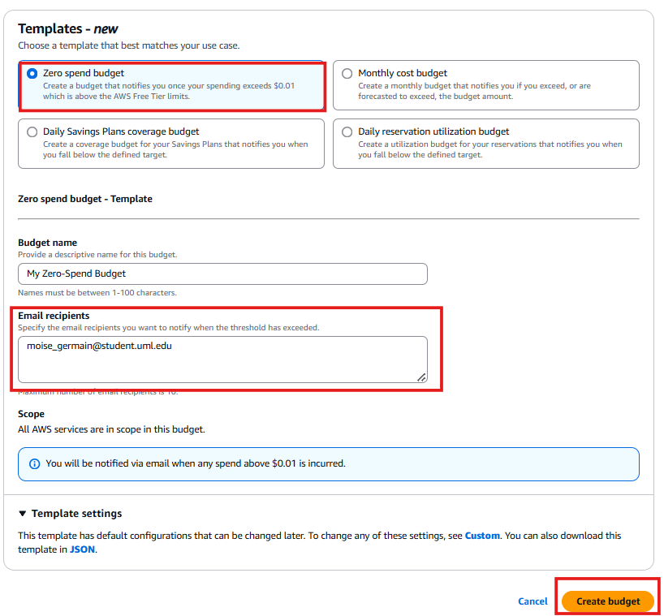
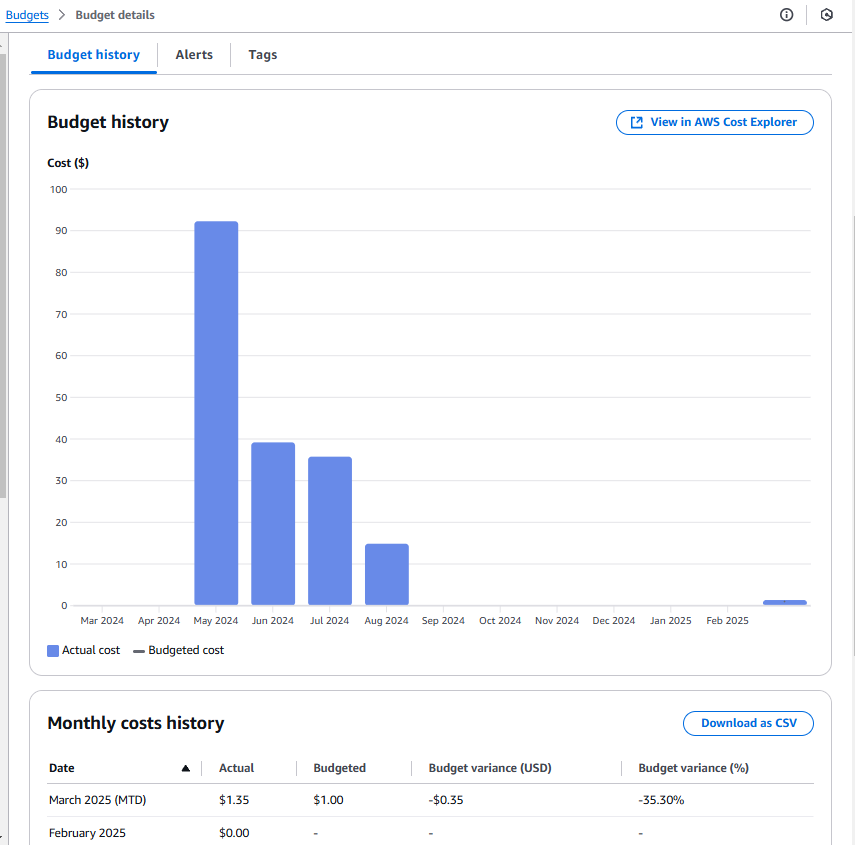

# 💰 Setting Up AWS Budgets

In this section, I will **set up AWS Budgets** to monitor my AWS spending and receive alerts when costs exceed a predefined threshold. AWS Budgets helps me **track costs, usage, and detect unexpected spending** before it becomes an issue.

---

## 🚀 **Step-by-Step: AWS Budgets Setup**

### **1️⃣ Access AWS Budgets**
- Navigate to Billing and Cost Management
- Select Billing and Payments
- I will keep the default values, enter my email addresses to receive notifications.
- Click **Create a budget**.

📸 

2️⃣ Choose Budget Type
AWS allows me to create different types of budgets, including:

| **Budget Type	Purpose**     |
|-----------------------------|---------------------------------------------------------------|
| **Cost Budget**	            |Tracks overall AWS spend against a set limit.                  |
| **Usage Budget**	          |Monitors AWS service consumption (e.g., EC2 hours, S3 storage).|
| **Reservation Budget**	    |Ensures I’m maximizing Reserved Instance coverage.             |
| **Savings Plan Budget**	    |Tracks my AWS Savings Plan usage efficiency.                   |

I will create a Cost Budget.
Select Cost Budget → Click Next.
📸 

✅ AWS Budget is Now Set Up!
Now, I have a real-time monitoring system that alerts me when AWS costs exceed the set limits.

🚀 Next Steps
➡️ Set Up AWS Cost Anomaly Detection
➡️ Optimize AWS Resource Costs
