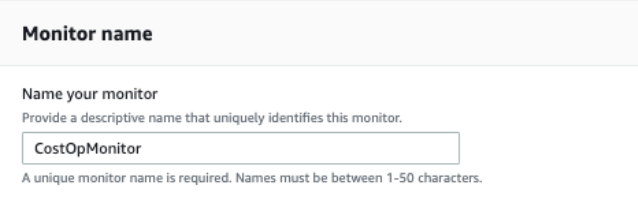
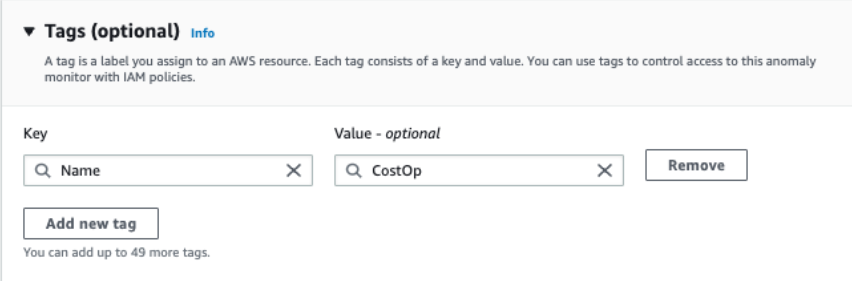
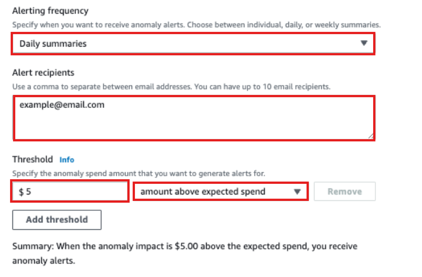
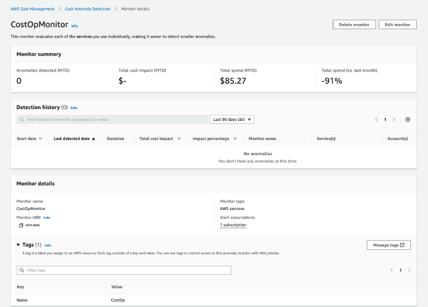

# 🚨 Setting Up AWS Cost Anomaly Detection

AWS Cost Anomaly Detection helps me **automatically track cost and usage** to identify unexpected spending patterns. By setting up cost monitors, I can detect outliers compared to my typical AWS usage and take action before costs escalate.

---

## 🚀 **Step-by-Step: AWS Cost Anomaly Detection Setup**

### **1️⃣ Access AWS Cost Anomaly Detection**
- Open Billing and Cost Management
- In the **left-hand menu**, select **Cost Anomaly Detection**.

2️⃣ Get Started with Cost Anomaly Detection
Click Get Started.
If prompted, select Skip Tour.

3️⃣ Create a Cost Monitor
Scroll down to the Cost Monitors tab.
Click Create Monitor.

📸 

CostOpMonitor
Tagging (Optional): Add a new tag:
Key: Name
Value: CostOp
Click Next.

📸 
5️⃣ Configure Alert Subscription
Now, I’ll set up notifications to alert my team when an anomaly is detected.

Click Create a new subscription.
Subscription Name:
Finance Team
Alerting Frequency:
Select Daily summaries.
Alert Recipients:
Enter my email address to receive anomaly alerts.
Threshold:
Enter $5.00, and select "amount above expected spend" from the dropdown.
Tagging (Optional):
Key: Name
Value: CostOp
Click Next.

📸 
6️⃣ Finalize and Create Monitor
Click Create Monitor to finish setup.

7️⃣ Verify Setup
The next screen confirms successful creation of the monitor.
I can now view it under Cost Monitors in the Cost Anomaly Detection dashboard.

📸
✅ AWS Cost Anomaly Detection is Now Set Up!
Now, my system will automatically track AWS spending patterns and notify me of unexpected cost spikes.

🚀 Next Steps
➡️ **[Optimize Resources.md](../Docs/optimize-resources.md)**
