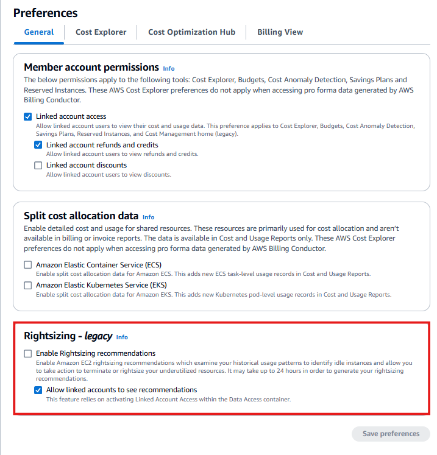
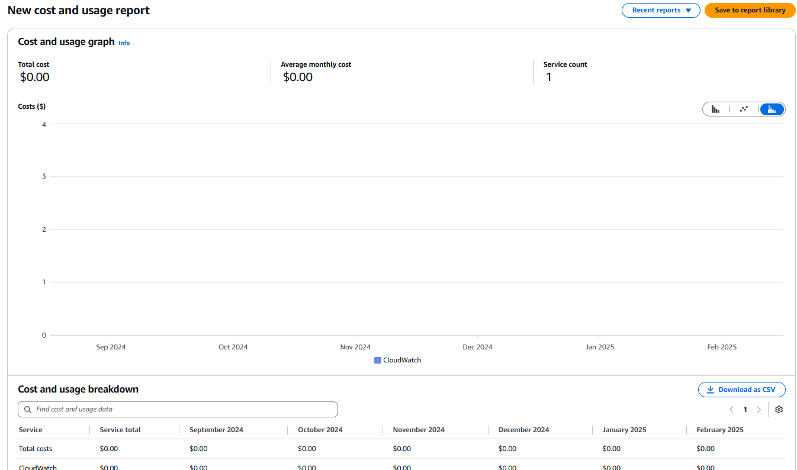
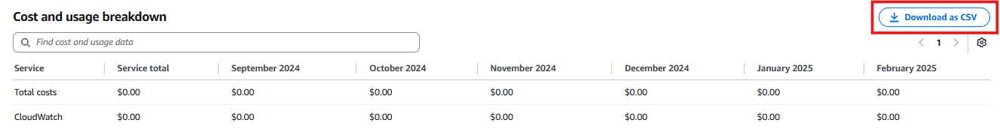

# 📊 Setting Up AWS Cost Explorer

In this section, I'll set up **AWS Cost Explorer**, which provides powerful visualization and analysis tools to understand my AWS costs and usage patterns. Using Cost Explorer, I'll be able to quickly generate custom reports, spot trends, identify cost drivers, and even receive resource recommendations for optimizing my infrastructure.

---

## 🚀 **Step-by-Step: AWS Cost Explorer Setup**

### **1️⃣ Accessing the AWS Cost Management Console**

- Search for **AWS Cost Management**

> **Note:**  
> If this is the first time I'm using AWS Cost Management tools, AWS may take up to **24 hours** to prepare my cost and usage data.
> 
### **2️⃣ Configuring Cost Explorer Preferences**
I'll ensure that I receive recommendations for optimizing resources, such as right-sizing EC2 instances.

On the left-hand side, click on Preferences.
✅ Check the option for:
Enable Rightsizing Recommendations
Click Save Preferences to apply changes.

Why am I doing this?
By enabling resource recommendations, AWS provides suggestions for optimizing resource usage, potentially leading to significant cost savings.

### **3️⃣ Exploring the Cost Explorer Reports**
From the left-hand side menu, select Cost Explorer.
AWS displays my current Cost and Usage Breakdown.
I can see the current month’s spend, identify cost trends, and understand the main cost drivers in my AWS account.
📸

Optionally, I can Download the Cost Report as a CSV file by clicking:
Download as CSV button (top right).
📸

✅ AWS Cost Explorer is Now Set Up!
I now have a clear view of my AWS spending and usage, which helps me manage my cloud costs efficiently and identify opportunities for optimization.

🚀 Next Steps
➡️➡️ **[Create Cost Reports](../Docs/create-cost-reports.md)** 
