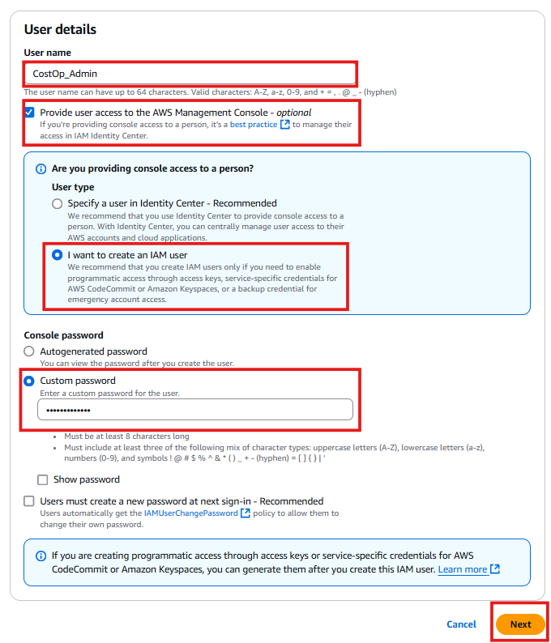
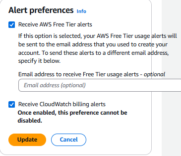
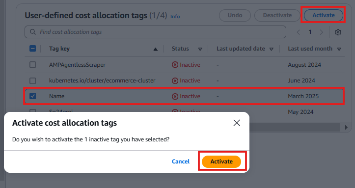
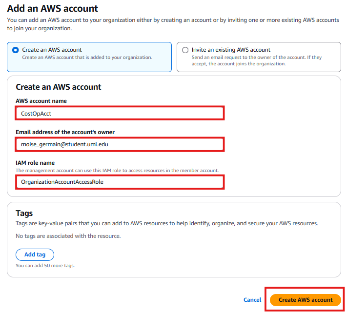
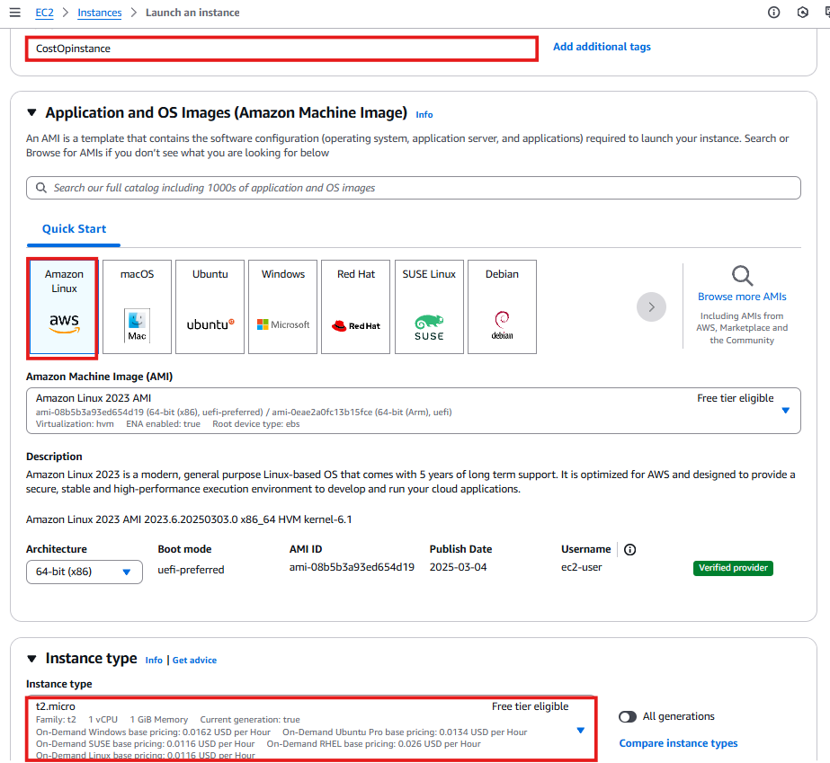

# 🚀 AWS Cost Management and Optimization Setup

In this project, I will build a solid foundation for managing my organization's billing, cost monitoring, and optimization using AWS services. The main services and tools I'll utilize include **AWS IAM**, **Billing Alarms**, **Cost Allocation Tags**, and **AWS Organizations**.

---

## 🔒 **1. Creating IAM Users and Groups**

AWS Identity and Access Management (IAM) helps me securely control access to AWS resources. I’ll first create IAM users for administration purposes.

### **Create IAM User**

- Open the **AWS Management Console**.
- Search and select **IAM** → **Users** → **Add Users**.
- Set the username to:  
CostOp_Admin
- Enable ✅ **AWS Management Console access** and select:
- ✅ **Create new password (auto-generated or custom)**.
- Click **Next**.

📸 

> **Why I'm doing this:**  
> IAM allows me to securely control access to AWS services and resources by defining user permissions clearly, promoting secure and efficient resource management.

---

## 👥 **Creating an IAM User Group **

IAM User Groups simplify permissions management by assigning common permissions to multiple users simultaneously.

- Click on **User Groups** → **Create Group**.
- Enter group name:  
Sys_Admin_Group

- Assign policies (e.g., `AdministratorAccess` or a tailored policy for billing management).
- Add users to this group.

> 📌 **Best Practice:** Always follow the **Principle of Least Privilege** to enhance security.

---

## 📊 **2. Enable Billing Alarms and Cost Allocation Tags**

To effectively manage AWS costs, I'll set up **billing alerts** and **cost allocation tags**.

### 🔔 **Billing Alarms Setup**
Billing alarms proactively notify me of costs exceeding specified limits.

- Navigate to **AWS Console → Billing Dashboard**.
- Click **Billing Preferences**.
- Enable ✅ **Receive Billing Alerts**.
- Click **Save preferences**.

📸 

---

### 🏷️ **Cost Allocation Tags Setup**
Cost Allocation Tags help me track and categorize AWS expenses.

- In the **Billing Dashboard**, navigate to **Cost Allocation Tags**.
- Activate tags (e.g., `Name`) to categorize resource costs.
- Click **Activate**.

📸 

---

## 📌 **Setting Up AWS Organizations**

Using AWS Organizations helps centrally manage billing and policies across multiple accounts.

- Navigate to **AWS Console → AWS Organizations**.
- Click **Create an organization**.
- Verify your account via the email sent by AWS.

### **Creating an AWS Member Account**
- In **AWS Organizations** dashboard, click **Add an AWS Account**.
- Fill out the form:
- **Account name:** `CostOpAcct`
- **Email:** (use your AWS-associated email)
- **Role:** `Default`
- Assign tags:
- **Key:** `Name`
- **Value:** `CostOp`
- Click **Create AWS account**.

📸 

---

## 🖥️ **Launching EC2 Instances (Console Method)**

I'll now launch EC2 instances to host my cost management application or monitoring tools.

- Go to **EC2 Console → Launch Instances**.
- Instance settings:
| Setting          | Value                         |
|-------------------|------------------------------|
| Instance Type     | `t2.micro`                   |
| AMI               | `Amazon Linux 2 (Default)`   |
| Number of Instances | `2`                         |
- **Key pair:** Create new (`RSA`), save `.pem` file.
- **Security Group:** Allow `HTTP` & `HTTPS` from the internet.
- Click **Launch Instance**.

📸 

---

## ✅ **Resource Overview and Next Steps**

Now, my environment for AWS Cost Optimization and billing management is ready:

| Step                           | Outcome                                  |
|---------------------------------|---------------------------------------|
| ✅ IAM User                     | `CostOp_Admin` created                 |
| ✅ Billing Alarms               | Enabled cost alert notifications       |
| ✅ Cost Allocation Tags         | Tags activated to track AWS resources  |
| ✅ AWS Organizations            | Centralized management established     |
| ✅ EC2 Instances                | Two `t2.micro` instances running       |

---

## ✅ **Next Step**
➡️ **[Setup CID Dashboards](../docs/cost-dashboards.md)**  

