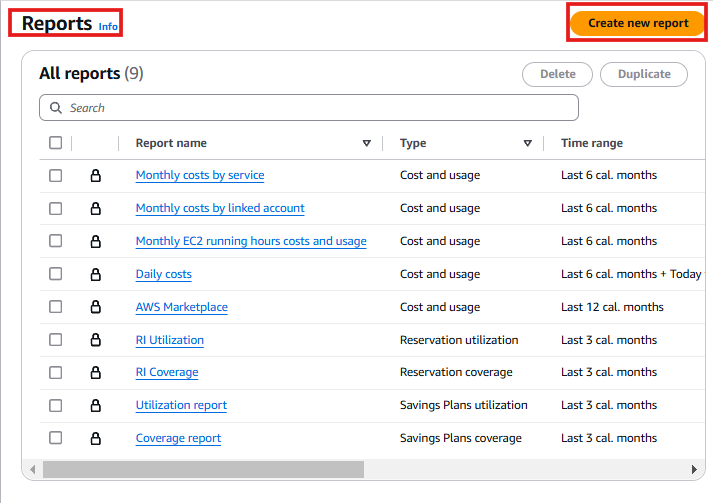
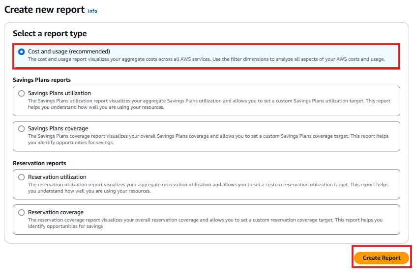
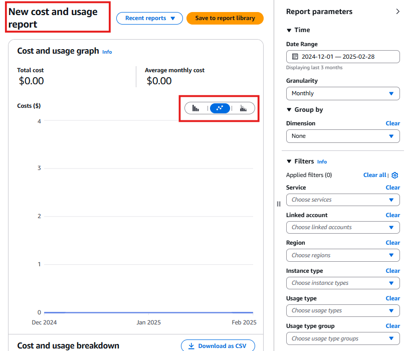

# 📊 Creating AWS Cost Reports

In this section, I will create **AWS Cost Reports**, which provide detailed insights into my AWS spending. These reports help me analyze **cost and usage trends, track savings plans, and monitor resource utilization**.

---

## 🚀 **Step-by-Step: Creating Cost Reports**

### **1️⃣ Access AWS Cost Reports**
In the Billing console
- From the left-hand menu, click **Reports**.

2️⃣ Create a New Cost Report
Click the Create new report button on the right side of the screen.
📸 

3️⃣ Select Report Type
AWS provides several types of cost reports, including:

|Report Type                  |Purpose                                   |
|-----------------------------|------------------------------------------|
|**Cost and Usage Report**	    |Tracks AWS spending trends over time.     |
|Savings Plans Utilization Report**	|Monitors how much of my Savings Plan is used.|
|Savings Plans Coverage Report**	|Shows how much my AWS services are covered under Savings Plans.|
|Reservation Utilization Report**	|Displays my usage of Reserved Instances.|
|Reservation Coverage Report**	|Checks if my Reserved Instances are fully utilized.|

For this guide, I will create a Cost and Usage Report.
Select Cost and Usage → Click Create Report.

📸 

4️⃣ Customize the Cost Report
Modify the graph type by selecting one of the available visualization options:
📈 Line Graph
📊 Bar Chart
🔲 Table View
Click Save to Report Library to store this report for future use.

📸 

✅ AWS Cost Report is Now Set Up!
Now, I can track cost trends, identify unexpected charges, and optimize my cloud usage efficiently.

🚀 Next Steps
➡️**[Create AWS Budgets](../docs/setup-aws-budgets.md)** 
