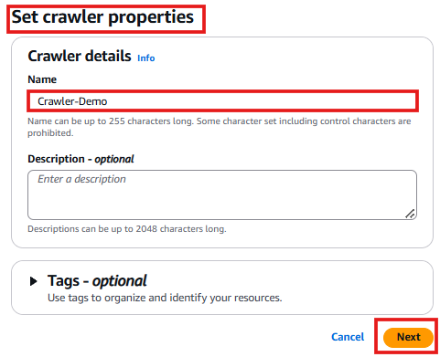
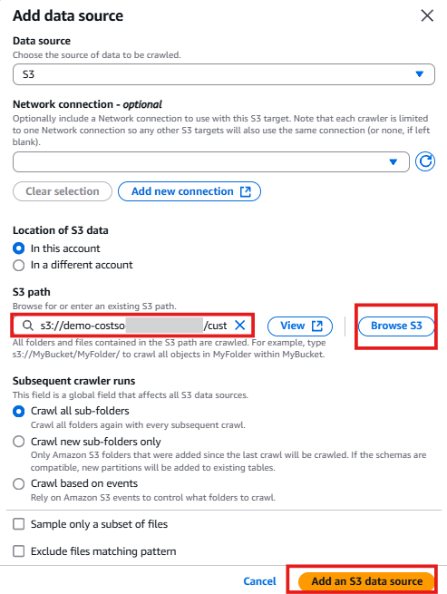
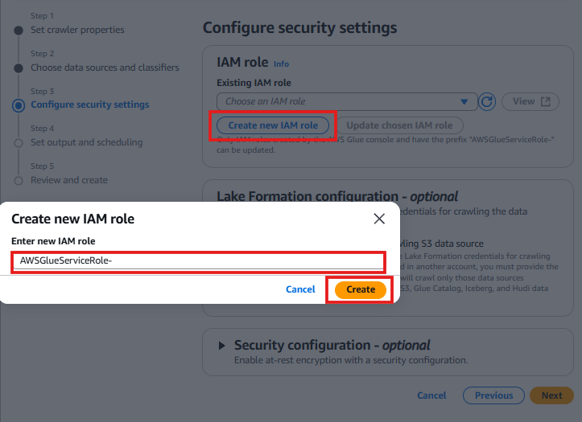
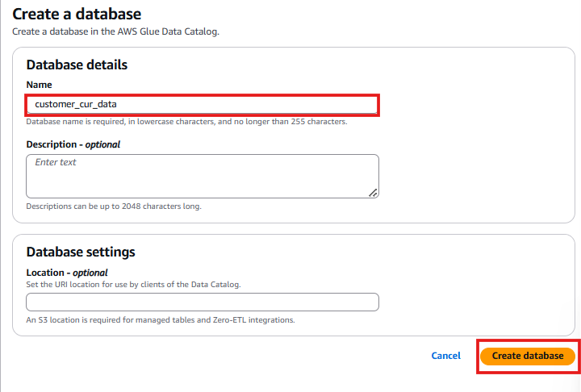
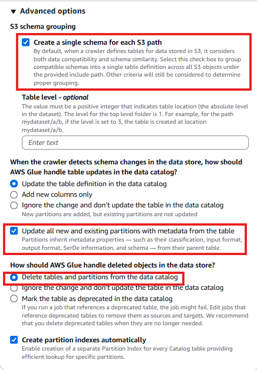
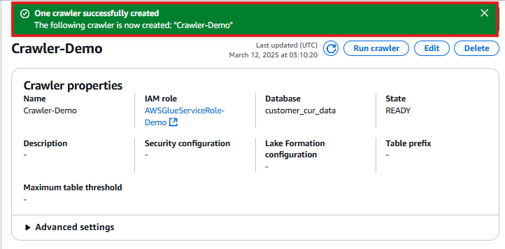
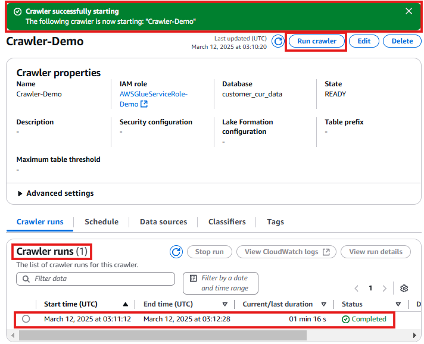

# 🛠️ Creating an AWS Glue Data Catalog Table

## **Introduction**
AWS **Glue** is a **serverless data integration service** that helps process, discover, and catalog data from multiple sources. This service is crucial for analytics, machine learning, and application development.

The **AWS Glue Data Catalog** serves as an **index for data location, schema, and metadata**. It helps define **tables that reference S3 data** for further processing in **Amazon Athena** and other analytics services.

In this section, I will:
✔️ Use a **Glue Crawler** to scan my **fabricated cost and usage dataset** in S3.  
✔️ Automatically create a **Glue Data Catalog Table** for querying with **Amazon Athena**.

---

## 🚀 **Step-by-Step Guide: Setting Up Glue Data Catalog**

---

## **1️⃣ Open AWS Glue Console**
2. Click **Data Catalog** in the left-hand menu.
3. Click **Crawlers**.
4. Click **Create Crawler**.

📸 

2️⃣ Create a New Crawler
Crawler Name:
Crawler-Demo

Click Next.
📸 

3️⃣ Add a Data Source (S3)
Click Add a data source.
Choose Data Source Type:
Select S3.
Select Data Location:
Click Browse and navigate to:

s3://demo-costso-[Account-ID]/customer_all/
(Replace [Account-ID] with my actual AWS account ID).
Leave all other settings default.
Click Add an S3 data source.
Click Next.

📸 

4️⃣ Create a New IAM Role for Glue
Choose IAM Role:
Select Create a new IAM role.
IAM Role Name:

AWSGlueServiceRole-Demo
Click Create.
Click Next.

📸 

5️⃣ Create a New Database for Glue
Click Add database.
Database Name:
customer_cur_data
Click Create Database.
📸 

6️⃣ Configure Crawler Target Database
Return to the crawler creation tab.
Click the refresh icon next to Target Database.
Select customer_cur_data.
Click Advanced options.
Enable the following settings:
✅ Create a single schema for each S3 path.
✅ Update all new and existing partitions with metadata from the table.
✅ Delete tables and partitions from the data catalog.
Click Next.

📸 

7️⃣ Finalize & Run Crawler
Click Create Crawler.
Click Run Crawler.

📸 

8️⃣ Verify Table Creation in Glue Data Catalog
The crawler will scan the dataset and create a table in about 1 minute.
Once completed, the Glue Data Catalog will now contain a table and schema for my cost and usage data.

📸 

✅ AWS Glue Data Catalog is Now Set Up!
I have successfully: ✔️ Configured AWS Glue Crawler to scan fabricated cost and usage data.
✔️ Created a Glue Data Catalog Table to store metadata.
✔️ Prepared the dataset for querying in Amazon Athena.

🚀 Next Steps
➡️ Query Cost Data with Amazon Athena
➡️ Visualizing Cost Data in QuickSight
