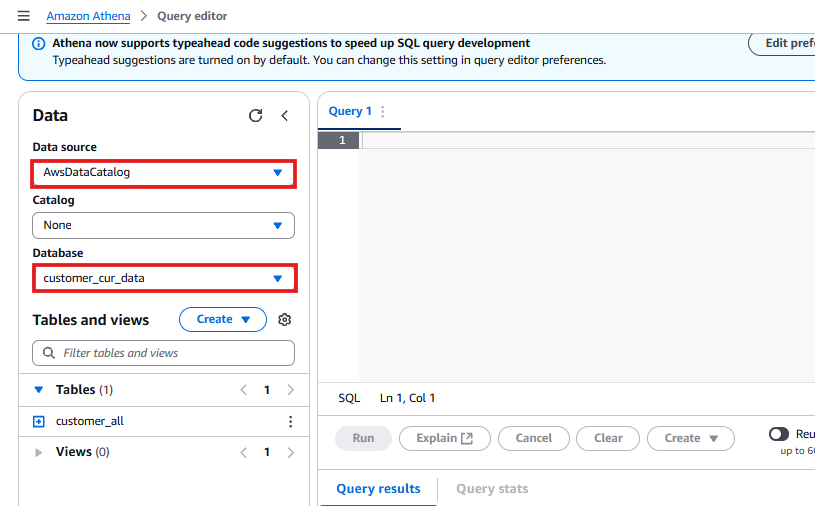
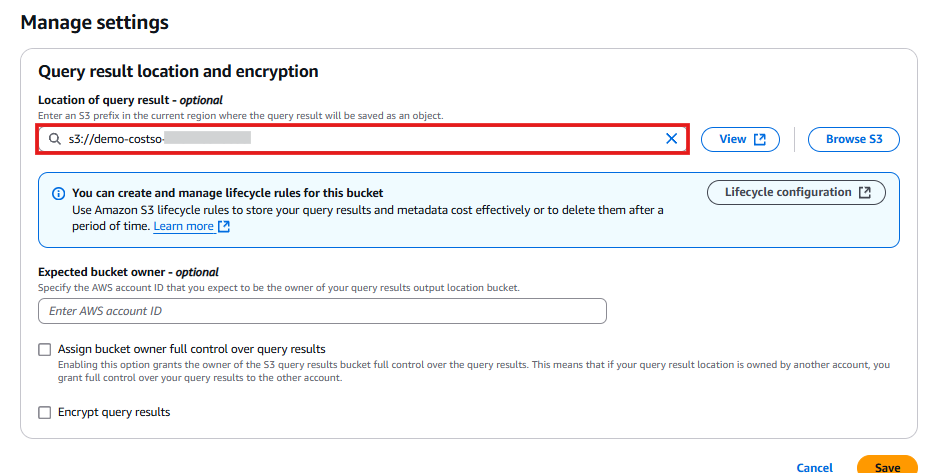
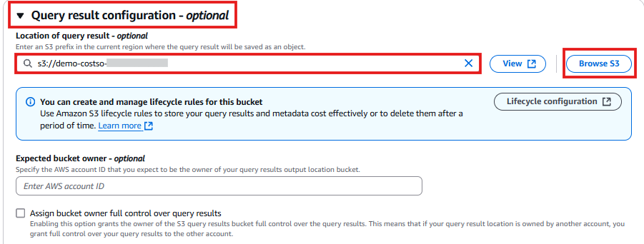
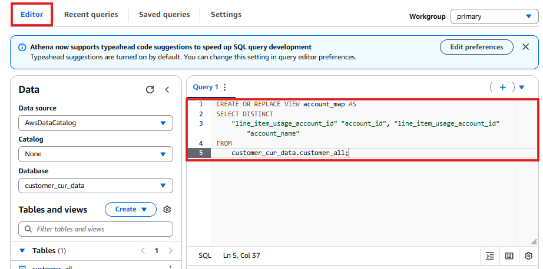
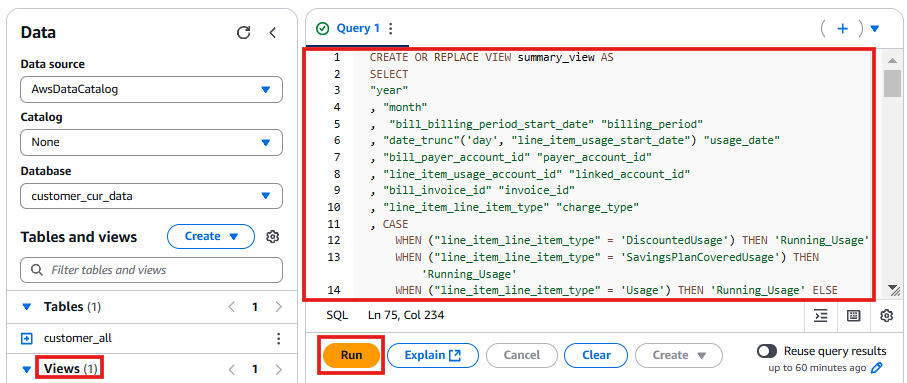
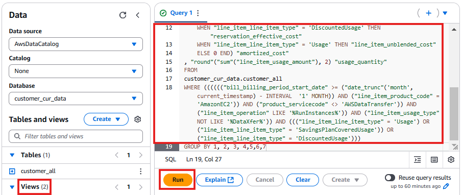
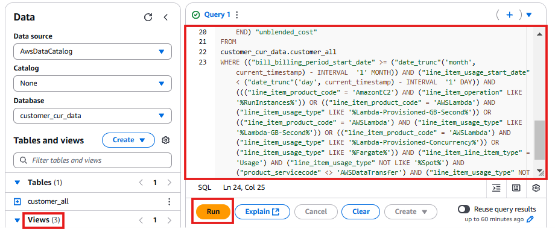
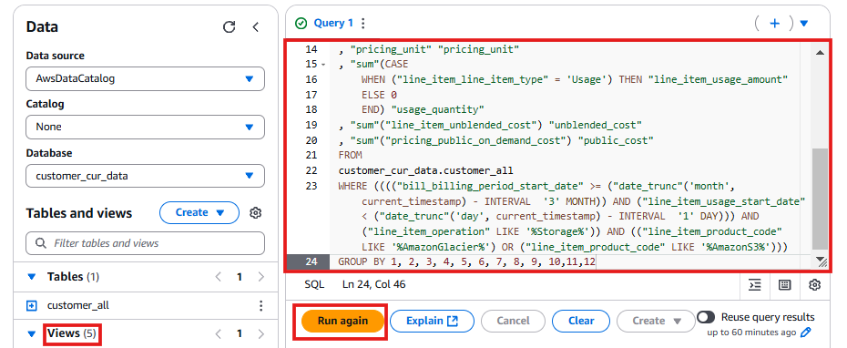

# 🔍 Defining Schema in Amazon Athena

## **Introduction**
**Amazon Athena** is a **serverless interactive query service** that enables me to **analyze data directly in Amazon S3** using **SQL**. It uses the **AWS Glue Data Catalog** to manage table metadata and schemas.

In this section, I will:
✔️ **Configure Athena's query settings**.  
✔️ **Create SQL views using Glue Data Catalog schema**.  
✔️ **Prepare the dataset for visualization in QuickSight**.

---

## 🚀 **Step-by-Step Guide: Configuring Athena and Creating Views**

---

## **1️⃣ Open Amazon Athena**
1. Open the **[Amazon Athena Console](https://console.aws.amazon.com/athena/home)**.
2. Click **Launch Query Editor** on the right-hand side.

2️⃣ Verify the Glue Database and Table
Ensure the Glue database (customer_cur_data) and the table created by the crawler (customer_all) are visible in Athena.
📸 

3️⃣ Configure Query Results Location
Click Settings in the top menu.
Click Manage.
Click Browse S3.
Select the demo-costso-[Account-ID] bucket.
Click Choose.
Click Save.
📸

4️⃣ Configure Workgroup Settings
Click Workgroups on the left-hand menu.
Select the Primary Workgroup.
Click Edit in the top-right corner.
Expand Query result configuration.
Click Browse S3 and select the demo-costso-[Account-ID] bucket.
Click Save Changes.
📸

5️⃣ Open Query Editor and Create SQL Views
Now that Athena is set up, I'll create multiple SQL views to structure the cost and usage data.

🔹 Creating the Account Map View
CREATE OR REPLACE VIEW account_map AS
SELECT DISTINCT
    "line_item_usage_account_id" AS "account_id",
    "line_item_usage_account_id" AS "account_name"
FROM
    customer_cur_data.customer_all;

Paste the query into the Athena Query Editor.
Click Run.
📸

🔹 Creating the Summary View
CREATE OR REPLACE VIEW summary_view AS
SELECT
    "year",
    "month",
    "bill_billing_period_start_date" AS "billing_period",
    DATE_TRUNC('day', "line_item_usage_start_date") AS "usage_date",
    "bill_payer_account_id" AS "payer_account_id",
    "line_item_usage_account_id" AS "linked_account_id",
    "bill_invoice_id" AS "invoice_id",
    "line_item_line_item_type" AS "charge_type",
    CASE 
        WHEN ("line_item_line_item_type" = 'DiscountedUsage') THEN 'Running_Usage' 
        WHEN ("line_item_line_item_type" = 'SavingsPlanCoveredUsage') THEN 'Running_Usage' 
        WHEN ("line_item_line_item_type" = 'Usage') THEN 'Running_Usage' 
        ELSE 'non_usage' 
    END AS "charge_category",
    "product_product_name" AS "product_name",
    SUM("line_item_unblended_cost") AS "unblended_cost"
FROM
    customer_cur_data.customer_all
GROUP BY 1, 2, 3, 4, 5, 6, 7, 8, 9, 10;

Paste the query into the Athena Query Editor.
Click Run.
📸 

🔹 Creating the EC2 Running Costs View
CREATE OR REPLACE VIEW ec2_running_cost AS 
SELECT DISTINCT
    "year",
    "month",
    "bill_billing_period_start_date" AS "billing_period",
    DATE_TRUNC('hour', "line_item_usage_start_date") AS "usage_date",
    "bill_payer_account_id" AS "payer_account_id",
    "line_item_usage_account_id" AS "linked_account_id",
    SUM("line_item_unblended_cost") AS "amortized_cost"
FROM
    customer_cur_data.customer_all
WHERE
    "line_item_product_code" = 'AmazonEC2'
    AND "line_item_operation" LIKE '%RunInstances%'
GROUP BY 1, 2, 3, 4, 5, 6;

Paste the query into the Athena Query Editor.
Click Run.
📸

🔹 Creating the Compute Savings Plan Eligible Spend View
CREATE OR REPLACE VIEW compute_savings_plan_eligible_spend AS 
SELECT DISTINCT
    "year",
    "month",
    "bill_payer_account_id" AS "payer_account_id",
    "line_item_usage_account_id" AS "linked_account_id",
    SUM("line_item_unblended_cost") AS "unblended_cost"
FROM
    customer_cur_data.customer_all
WHERE
    "line_item_product_code" = 'AmazonEC2'
    AND "line_item_operation" LIKE '%RunInstances%'
GROUP BY 1, 2, 3, 4, 5;
Paste the query into the Athena Query Editor.
Click Run.
📸

🔹 Creating the S3 View
CREATE OR REPLACE VIEW s3_view AS 
SELECT DISTINCT
    "year",
    "month",
    "bill_billing_period_start_date" AS "billing_period",
    DATE_TRUNC('day', "line_item_usage_start_date") AS "usage_date",
    "bill_payer_account_id" AS "payer_account_id",
    "line_item_usage_account_id" AS "linked_account_id",
    "line_item_product_code" AS "product_code",
    SUM("line_item_unblended_cost") AS "unblended_cost"
FROM 
    customer_cur_data.customer_all
WHERE 
    "line_item_product_code" LIKE '%AmazonS3%'
GROUP BY 1, 2, 3, 4, 5, 6, 7, 8;

Paste the query into the Athena Query Editor.
Click Run.
📸

✅ Athena Views Are Now Set Up!
I have successfully: ✔️ Configured Athena's settings and workgroups.
✔️ Created structured SQL views for cost and usage analysis.
✔️ Prepared the dataset for visualization in QuickSight.

🚀 Next Steps
➡️ **[Setup Quicksight](../docs/setup-quicksight.md)**

