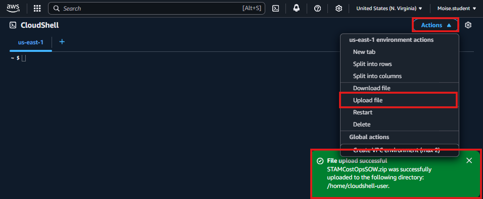
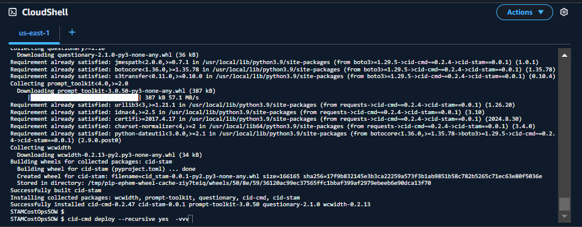
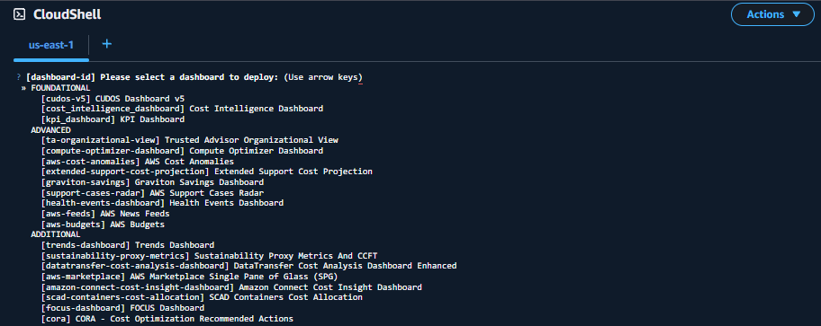
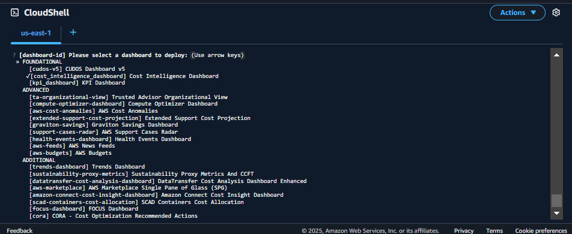
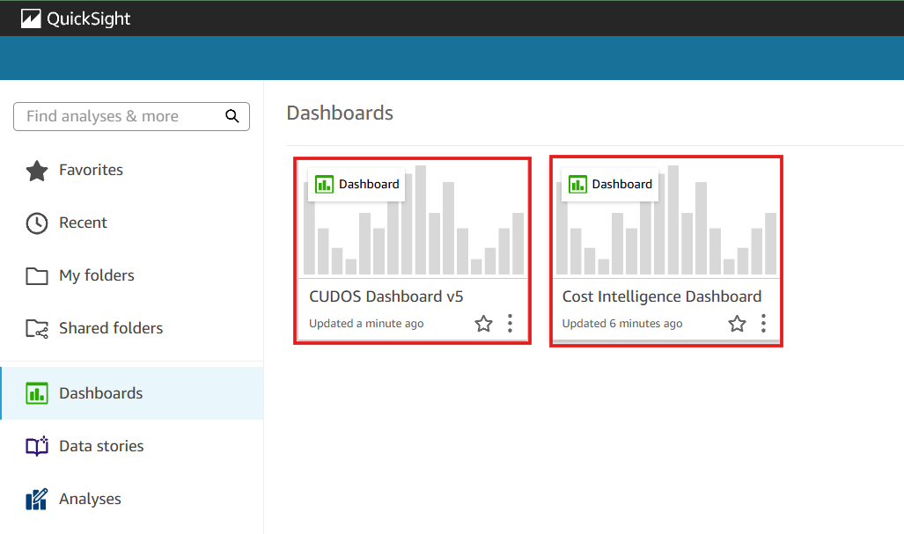
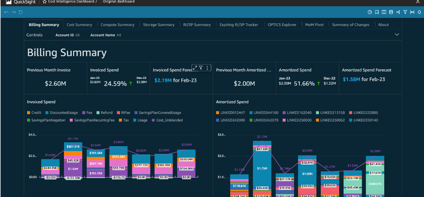

# 🚀 Deploying AWS Cost Intelligence Dashboards

## **Introduction**
In this section, I will deploy the **AWS Cost Intelligence Dashboards** using **AWS CloudShell** and **Amazon QuickSight**.  
This will allow me to visualize **AWS cost and usage data** efficiently.

🔹 **Why use AWS CloudShell?**  
AWS CloudShell is a **browser-based terminal** that is **pre-authenticated** with my AWS credentials and comes with pre-installed tools, making it easy to deploy AWS resources **without additional setup**.

---

## **1️⃣ Open AWS CloudShell**
1. Navigate to **[AWS CloudShell](https://console.aws.amazon.com/cloudshell/home)**
2. Wait for CloudShell to initialize.

📸 

2️⃣ Download the Dashboard Deployment Package
Download the deployment package:
STAMCostOpsSOW.zip
In CloudShell, click on Actions → Upload a file.
Select and upload the STAMCostOpsSOW.zip file.
📸

3️⃣ Extract and Install the Deployment Package
Run the following commands in CloudShell:
unzip STAMCostOpsSOW.zip
cd STAMCostOpsSOW
pip3 install -U .

📸

4️⃣ Deploy the Cost Intelligence Dashboard
Execute the deployment command:
cid-cmd deploy --recursive yes -vvv

Use the arrow keys to select Cost Intelligence Dashboard and press Enter.
📸

When asked if I want to share the dashboard with everyone in the account, I will press Enter to choose Yes.
5️⃣ Deploy the CUDOS Dashboard
Run the deployment command again:
cid-cmd deploy --recursive yes -vvv

Use the arrow keys to select CUDOS Dashboard and press Enter.
📸

When asked if I want to share the dashboard with everyone in the account, I will press Enter to choose Yes.
6️⃣ View Dashboards in QuickSight
Go back to Amazon QuickSight
Click Dashboards in the left menu.
Open and explore both the Cost Intelligence and CUDOS Dashboards.
📸

7️⃣ Explore the Dashboard Visuals
Since this is fabricated data, some of the visualizations may not align with real-world AWS costs.
I will navigate through each tab to explore different cost breakdowns and usage trends.

📸

✅ Dashboards Successfully Deployed!
✔️ I have deployed the Cost Intelligence and CUDOS Dashboards.
✔️ I can now analyze AWS costs and usage visually in QuickSight.

🚀 Next Steps
➡️ **[Cleanup Resources.md](../docs/cleanup-resources.md)**
