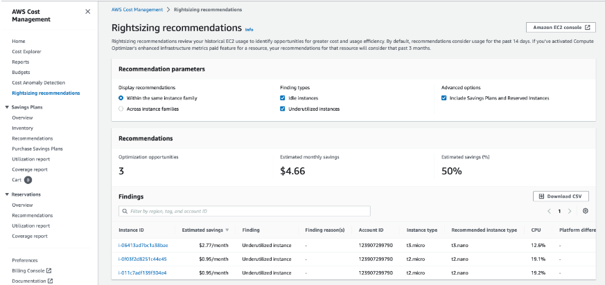
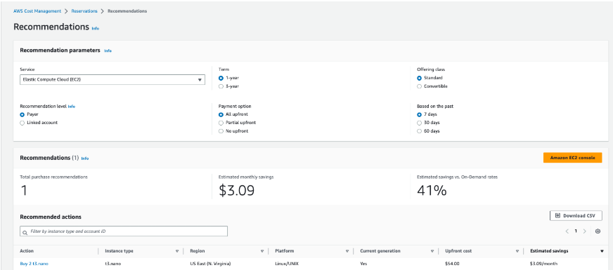

# 💰 Optimizing AWS Resources

AWS provides multiple ways to **optimize costs** and improve **resource efficiency**. In this section, I will explore **Rightsizing Recommendations, Savings Plans, and Reserved Instances** to reduce unnecessary costs while maintaining performance.

---

## 🚀 **Step-by-Step: Optimizing AWS Costs and Resources**

### **1️⃣ Access the AWS Cost Management Console**
- Navigate to Billing and Cost Management
- The dashboard displays my **current AWS spending and cost trends**.

📸 

🏗️ 1. Rightsizing Recommendations
Rightsizing helps me identify underutilized EC2 instances to either downsize or terminate to reduce costs.

✅ Steps to Access Rightsizing Recommendations
In the left-hand menu, select Rightsizing Recommendations.
AWS will analyze EC2 usage over the past 14 days.
If I have Compute Optimizer’s enhanced infrastructure metrics enabled, AWS will analyze the past 3 months.

📸 
Why do this?
Rightsizing ensures that I am not overpaying for EC2 instances I no longer need or that are over-provisioned.

💳 2. Savings Plan Recommendations
AWS Savings Plans allow me to commit to a consistent usage level in exchange for lower hourly rates.

✅ Steps to Access Savings Plans Recommendations
In the left-hand menu, select Savings Plans → Recommendations.
AWS analyzes my historical usage to determine cost-saving opportunities.
I can choose:
Compute Savings Plan: Covers EC2, AWS Fargate, and Lambda usage.
EC2 Instance Savings Plan: Covers specific EC2 instance families.

📸 

Why do this?
Savings Plans provide significant discounts over standard on-demand pricing, making long-term cloud usage more cost-effective.

🏷️ 3. Reserved Instance (RI) Recommendations
Reserved Instances offer discounted rates for committing to a 1-year or 3-year term.

✅ Steps to Access Reserved Instance Recommendations
In the left-hand menu, select Reservations → Recommendations.
AWS provides RI purchase recommendations for:
EC2 Instances
RDS (Relational Database Service)
Redshift
ElastiCache
Elasticsearch
I can fine-tune my recommendations by adjusting the parameters.

📸

Why do this?
If I have predictable workloads, Reserved Instances can save me up to 75% compared to On-Demand pricing.

✅ AWS Cost Optimization Is Now Set Up!
By following these steps, I can analyze my AWS costs and apply savings strategies to minimize expenses while maintaining efficiency.

🚀 Next Steps
➡️ ➡️ **[Clean Up Resources.md](../docs/clean-up-resources.md)**
