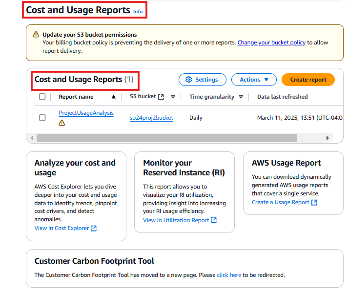
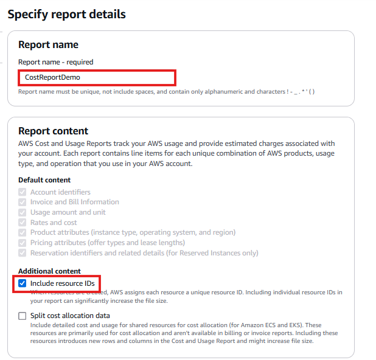
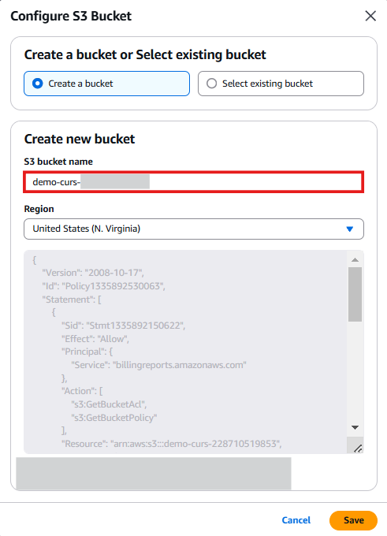
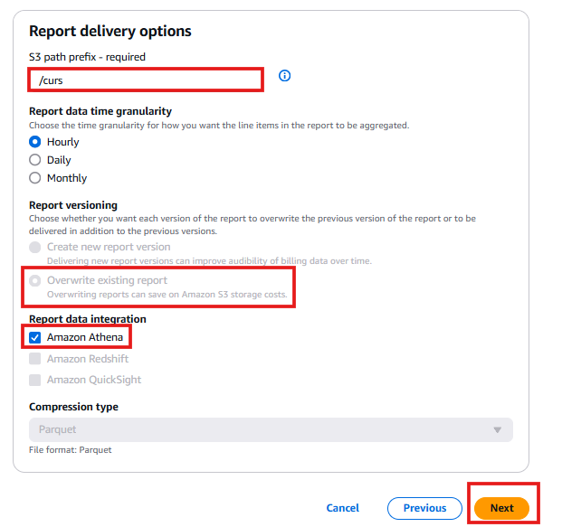
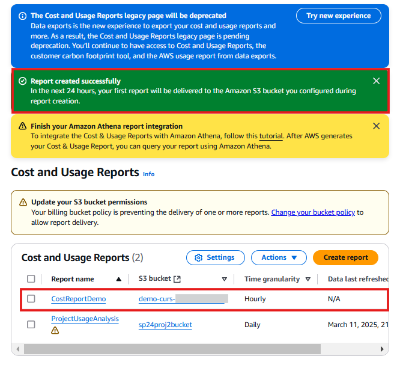
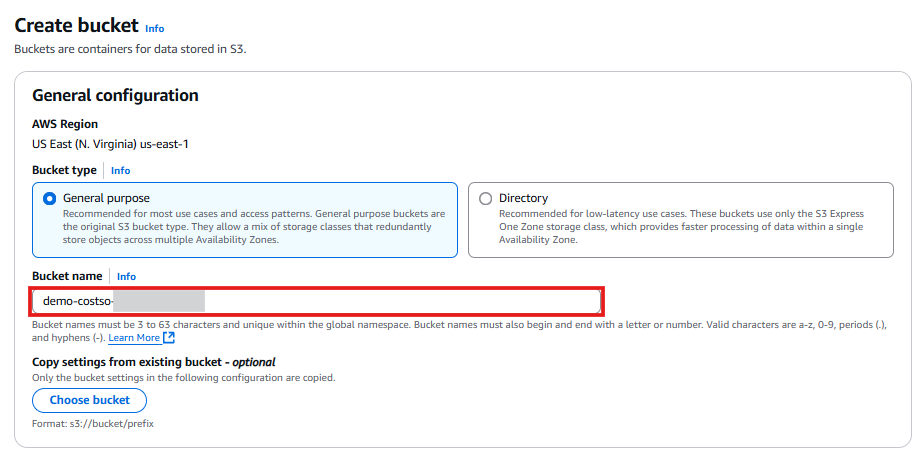
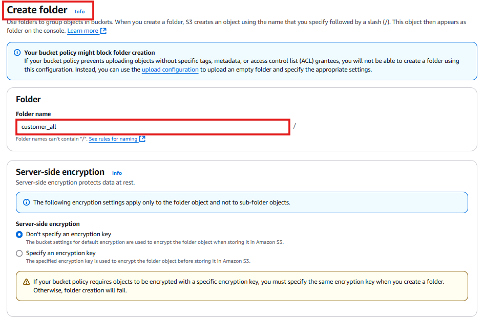
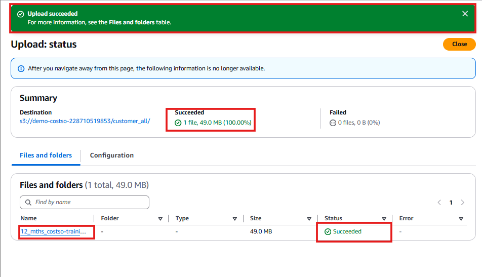

# 📊 Setting Up AWS Cost and Usage Reports (CUR)

The **AWS Cost & Usage Report (CUR)** provides **detailed cost and usage data**, allowing me to track AWS spending across services and accounts. This report includes **resource-level metadata, pricing details, and billing insights**.  

---

## 🚀 **Step-by-Step: Setting Up Cost and Usage Reports**

---

## **1️⃣ Go to the AWS Billing Service**
1. Open Billing and Cost Management
2. Click **Cost and Usage Reports** in the left-hand menu.

📸

2️⃣ Create a New Cost & Usage Report
Click Create Report.
Report Name:
CostReportDemo

Check the box for Include Resource IDs.
Click Next.
📸 

3️⃣ Configure Amazon S3 as Report Destination
Click Configure to create a new S3 bucket.
Bucket Name:
demo-curs-[Account-ID]

Check the box for:
The following default policy will be applied to your bucket
Click Save.
📸 

4️⃣ Configure Report Settings
Report Path Prefix:
/curs

Report Versioning:
Select Overwrite existing report.
Enable Data Integration for Amazon Athena.
Click Next.
📸 

5️⃣ Finalize Cost & Usage Report Setup
Scroll down and click Create Report.
AWS will begin generating the first CUR report.
Important: The first report will be delivered to S3 within 24 hours.
📸 

📂 Setting Up Fabricated Data for Demo
Since this AWS account does not have prior spending history, I will use sample cost and usage data instead.

6️⃣ Create an S3 Bucket for Fabricated Data
Open the AWS S3 Console.
Click Create Bucket.
Bucket Name:
demo-costso-[Account-ID]

Leave all settings default.
Click Create Bucket.

📸

7️⃣ Upload Sample Cost & Usage Data
Open the S3 bucket I just created.
Click Create Folder.
Folder Name:
customer_all

Click Create Folder.
📸 

8️⃣ Upload the Sample CUR File
Download the 12-month sample cost & usage report file:
📥 Download Sample CUR File (https://static.us-east-1.prod.workshops.aws/public/cdd75b0d-c1db-46bd-b5c6-e97a728e1874/static/common/cost_monitoring_observability/12_mths_costso-training.parquet).
Open the customer_all folder in S3.
Drag and drop the sample CUR file.
Click Upload.
Click Close once the upload is complete.
📸 

✅ AWS Cost & Usage Reports Are Now Set Up!
I have successfully:

Configured AWS Cost & Usage Reports (CUR).
Created an S3 bucket to store reports.
Uploaded fabricated cost data for the demo.

🚀 Next Steps
➡️ Configure AWS Glue to Process Cost Data
➡️ Query Cost Data with Amazon Athena
