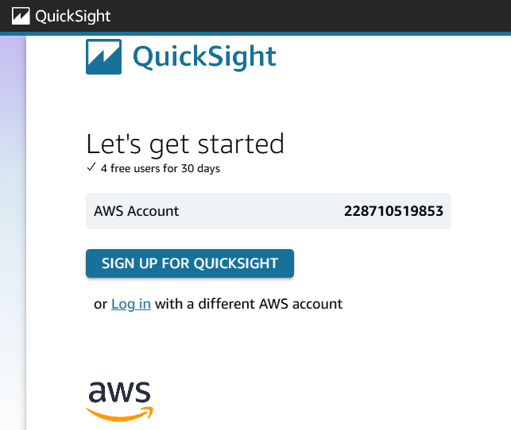
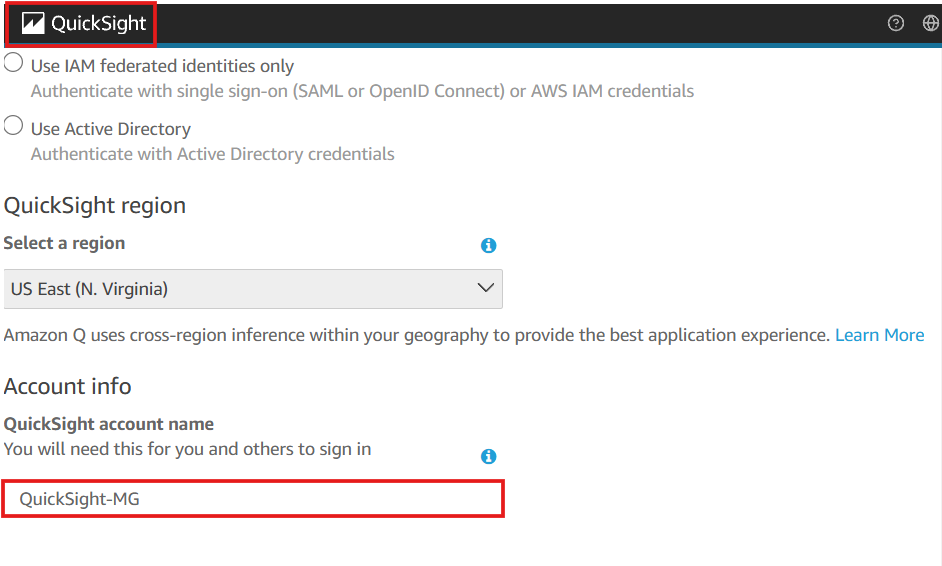
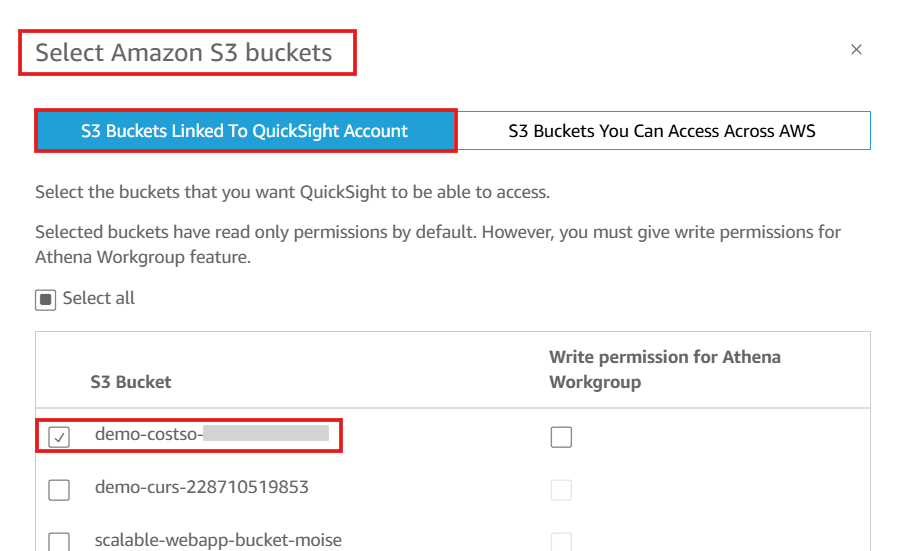
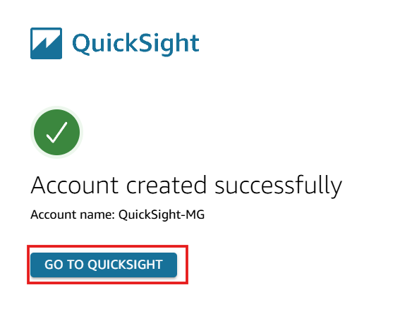
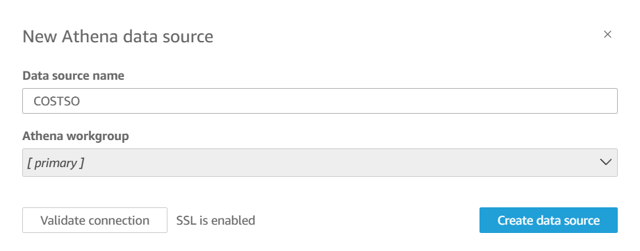
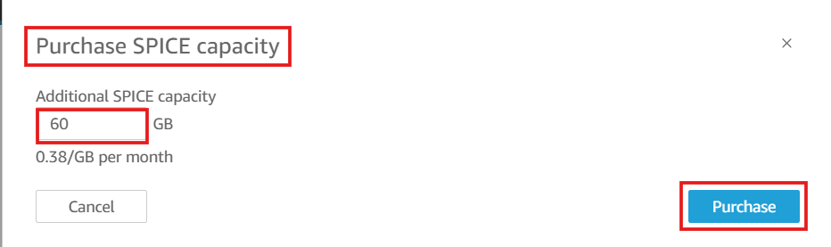

# 📊 Setting Up Amazon QuickSight for Cost Intelligence Dashboards

## **Introduction**
**Amazon QuickSight** is a **cloud-powered business analytics service** that allows me to **create visualizations, perform ad-hoc analysis, and gain insights from my AWS data sources**.  

In this section, I will:
✔️ **Set up Amazon QuickSight**.  
✔️ **Create a connection to Amazon Athena**.  
✔️ **Configure SPICE capacity for optimal performance**.  

---

## 🚀 Configuring QuickSight**

---

## **1️⃣ Open Amazon QuickSight**
1. Navigate to **[Amazon QuickSight](https://quicksight.aws.amazon.com/)**
2. Click **Sign Up for QuickSight**.

📸 

2️⃣ Configure QuickSight Settings
Keep the default settings and click Continue.
Enter the QuickSight account name and Notification Email Address.
Click Finish.
📸

3️⃣ Enable Amazon S3 Access
Check the box for Allow access and autodiscovery for these resources.
Select the S3 bucket containing the cost and usage data.
Click Finish.
📸

4️⃣ Open QuickSight Dashboard
Wait about 1 minute for QuickSight to complete the setup.
Click Go to Amazon QuickSight.
📸

5️⃣ Create a New Data Source (Athena)
Click Datasets in the left menu.
Click New dataset in the top-right corner.
Select Athena as the data source.
Enter COSTSO as the Data Source Name.
Click Create Data Source.
📸

6️⃣ Confirm the Data Source
QuickSight will now display the Athena connection setup.
Click Close to exit the screen.

7️⃣ Configure SPICE Capacity
SPICE (Super-fast, Parallel, In-memory Calculation Engine) is an optimized memory engine that improves query performance.

Click the Person Icon in the top-right corner.
Click Manage QuickSight.
In the left menu, click SPICE Capacity.
Click Purchase more capacity in the top-right corner.
Enter 60 in the field.
Click Purchase SPICE Capacity.
📸

8️⃣ Return to QuickSight
Click the QuickSight icon in the top-left to return to the home page.
📸

✅ QuickSight is Now Set Up!
I have successfully: ✔️ Created and configured Amazon QuickSight.
✔️ Connected QuickSight to Athena as a data source.
✔️ Configured SPICE for enhanced query performance.

🚀 Next Steps
➡️ **[Deploy Quicksight Dashboards](../docs/deploy-quicksight-dashboards.md)**
